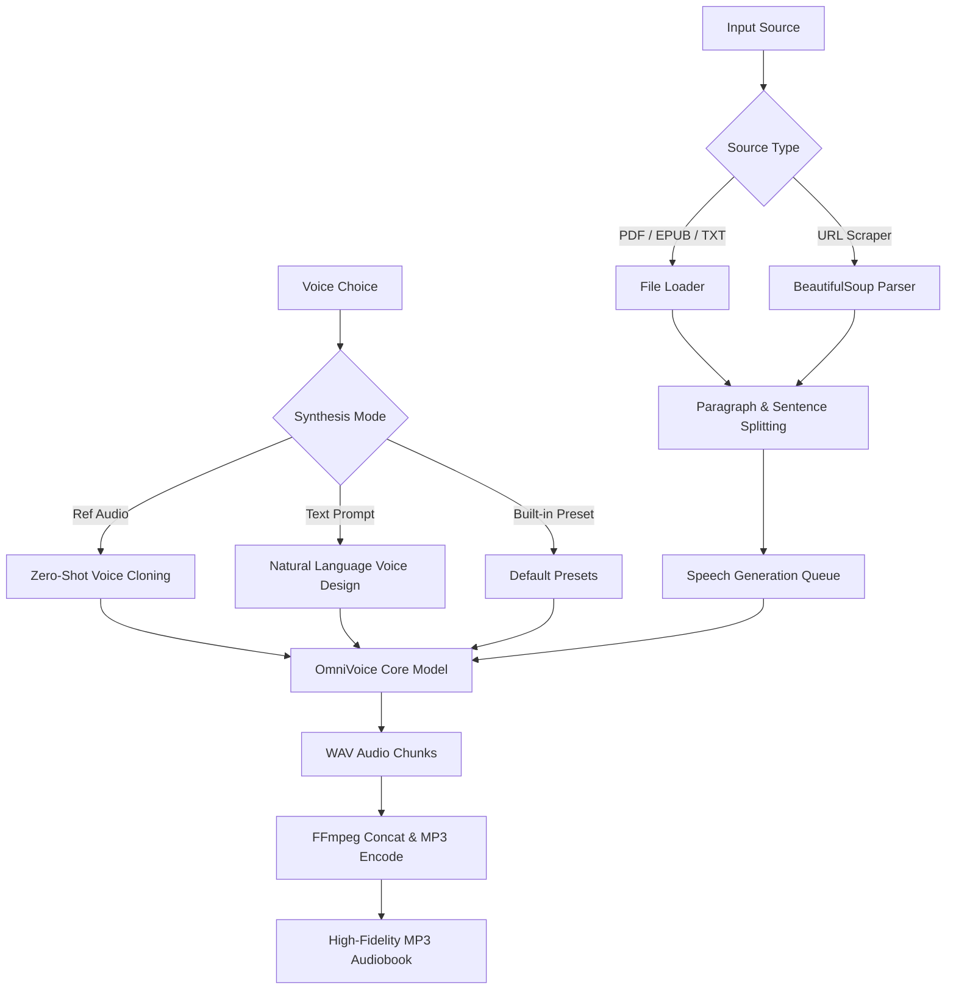

# 📖 Audiobook Studio: OmniVoice Edition

Turn any text, document, or webpage into a beautifully narrated audiobook — executed entirely locally on your desktop, optimized for both CPU and GPU execution.

Audiobook Studio loads PDFs, EPUBs, text files, or scrapes web articles directly. Narrate using built-in high-quality presets, type a natural-language **Voice Design** prompt, or clone any speaker's voice from a short audio clip. The studio splits your text into paragraphs, synthesizes each section sentence-by-sentence using state-of-the-art zero-shot diffusion language models, and seamlessly compiles them into a single high-fidelity MP3.

---

## 🎨 System Architecture

---

## ✨ Features

- **🗣️ Advanced Voice Design (Natural Prompting)**
  Synthesize custom voices from scratch simply by describing them. Type natural-language descriptions directly into the voice prompt box (e.g., `deep warm male voice, slow pace, dramatic tone` or `soft whispering voice, young energetic female, clear British accent`).
- **👥 State-of-the-Art Zero-Shot Voice Cloning**
  Mimic any target speaker's voice using a short (3 to 10 seconds) `.wav` or `.mp3` audio sample.
- **📚 Multi-Format Document Ingestion**
  Import books and articles instantly from PDFs, EPUBs, raw text files, or directly parse the main reading text from any web URL.
- **⚡ Advanced CUDA & GPU Auto-Detection**
  The double-click runner batch file automatically detects your NVIDIA GPU drivers, handles CUDA toolkit capability checks, and installs the matching hardware-accelerated PyTorch build (`cu124`, `cu121`, or `cu118`) or an optimized CPU-only PyTorch build to save download bandwidth.
- **🎯 Intelligent Chunking & Generation**
  Groups text into paragraph blocks but synthesizes sentence-by-sentence. This prevents trailing-off, keeps memory footprints low, ensures high-quality speech prosody, and completely avoids common zero-shot synthesis hallucinations.
- **🔊 Interactive Quick Sampling**
  Generate and play a quick 3-sentence audio preview of your configuration before starting a full multi-hour audiobook render.
- **💿 Fully Automated MP3 Compilation**
  Includes a automated setup that downloads and configures **FFmpeg** locally. It compiles all temporary paragraph chunks into a single, high-fidelity metadata-ready MP3 file and cleans up transient WAV files.
- **🔄 Fault-Tolerant Generation (Stop & Resume)**
  Stop the process gracefully at any time. Audiobook Studio saves progress and lets you resume from any specific paragraph index.

---

## 🚀 One-Click Setup & Launch

Audiobook Studio features a completely self-configuring startup system. To install and launch the application on Windows:

1. Double-click the **`run_omnivoice.bat`** file.
2. The installer will automatically perform the following steps:
   - Detect your local Python installation.
   - Initialize a isolated Python Virtual Environment (`.venv`) inside the project folder.
   - Run the GPU detector (`detect_cuda.py`) to query `nvidia-smi` and system libraries, installing the best-matching CUDA-accelerated or optimized CPU-only PyTorch builds.
   - Download, configure, and isolate **FFmpeg** directly in the project directory.
   - Install all required libraries (PyMuPDF, EbookLib, BeautifulSoup4, soundfile, omnivoice).
3. The modern, dark-themed Audiobook Studio desktop UI will launch automatically!

---

## 🖱️ Controls & Settings Guide

### Input & Files Section

| Control | Function |
| :--- | :--- |
| **Ref Audio (.wav/.mp3)** | Path to an audio clip for zero-shot voice cloning. Select a 3-10s clip. Leave blank to use Voice Prompts or presets instead. |
| **Output Directory** | Where your audiobook chunks and final compiled MP3 will be saved. Defaults to the repository root. |
| **Load PDF/Text/EPUB** | Open a file dialog to parse text from local books and documents. |
| **Scrape from URL** | Enter any web link to download and strip article or chapter content automatically. |

### Settings & Synthesis Engine

| Setting | Range / Options | Description |
| :--- | :--- | :--- |
| **Voice Prompt** | Built-in presets or Custom Prompt | Built-in presets (`alba`, `marius`, `javert`, `jean`, `fantine`, `cosette`, `eponine`, `azelma`) or custom description strings. Disabled if a **Ref Audio** file is loaded. |
| **Chunk Size** | 10 to 5,000 words | The word count boundary for paragraph splits. Each paragraph acts as a resume checkpoint. |
| **Temperature** | 0.1 to 2.0 | Controls synthesis creativity. Lower values are more stable; higher values introduce more expression/variability (0.7 recommended). |
| **Speed** | 0.5x to 2.0x | Model-native playback rate modifier. Modifies speed directly during neural synthesis, preventing robotic pitch shifting. |
| **Start Chunk** | 1 to 9999 | Select which paragraph index to begin generation from (essential for resuming interrupted tasks). |
| **Combine into MP3** | Checkbox + Output name | Automatically merges generated files and packages them into a single high-fidelity MP3. |

### Action Terminal

| Action | Function |
| :--- | :--- |
| **Export Chunk** | Saves the active paragraph text block to a `.txt` file for editing. |
| **Export All** | Exports every paragraph chunk to numbered `.txt` files for preview. |
| **Open Folder** | Opens the designated output directory in Windows Explorer. |
| **Generate Speech** | Begins processing the document. The UI displays real-time statistics (average speed, words/sec, and estimated time remaining). |
| **Stop** | Signals the generator to stop rendering safely immediately after completing the current chunk. |
| **Quick Sample** | Synthesizes and plays a short preview passage using your current voice settings. |

---

## 💡 Professional Narrative Guidelines

1. **Crafting Custom Voices:** Use descriptive, comma-separated tokens in the **Voice Prompt** input. Combining characteristics yields the best results, e.g., `mature voice, deep baritone, slow cadence, crisp podcast narration style`.
2. **Optimizing Voice Clones:** For clean, professional voice cloning, use a 5-to-10 second clip. Ensure the clip has high-quality recording conditions, no background music, no noise, and minimal room reverb.
3. **Resuming Large Books:** If you stop generation, look at the output directory to find the last successfully generated chunk number (e.g. `output_14.wav`). Simply set the **Start Chunk** to `15` to pick up exactly where you left off.
4. **Memory Management:** For massive multi-hour books, a Chunk Size of `80` to `120` words provides the best balance between narration continuity and operational safety.

---

## 📄 License, Attribution & Ethics

This project uses the **OmniVoice** model by k2-fsa under the Apache 2.0 license.

> [!IMPORTANT]  
> **Synthetic Voice Ethics Policy**
> - **Consent First:** Do not clone any individual's voice without their explicit, documented consent.
> - **Deception Prevention:** Do not use synthetic voices to impersonate public figures, create deepfakes, or generate deceptive media.
> - **Label Synthetic Output:** Always disclose to listeners that the audiobook narration was generated synthetically using AI.

